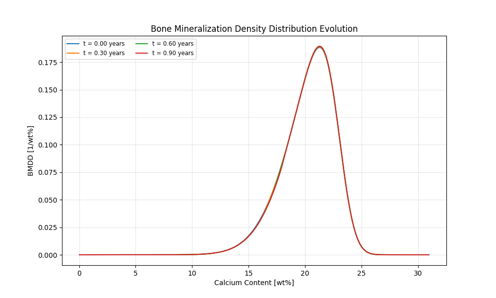
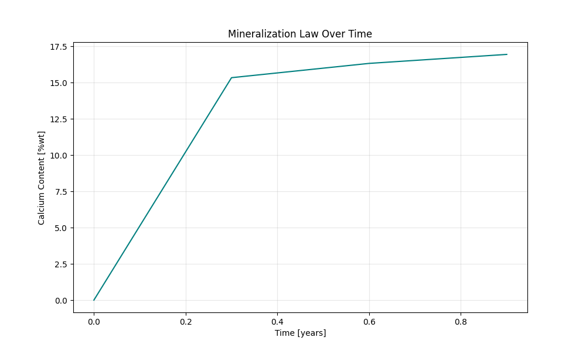
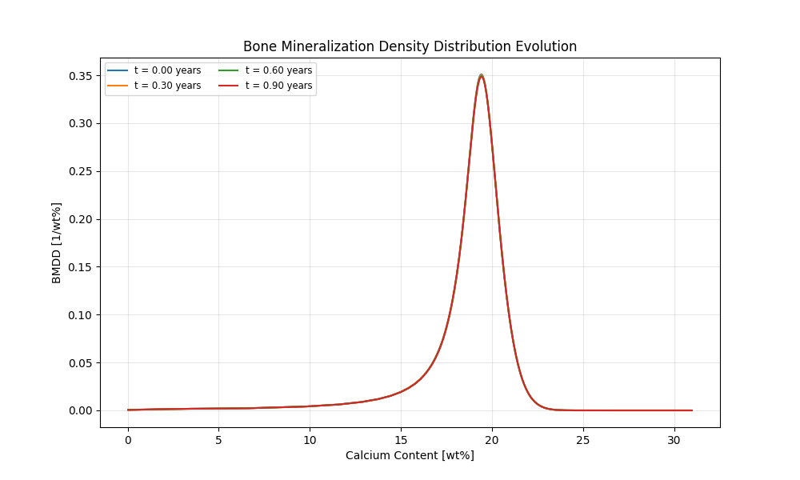
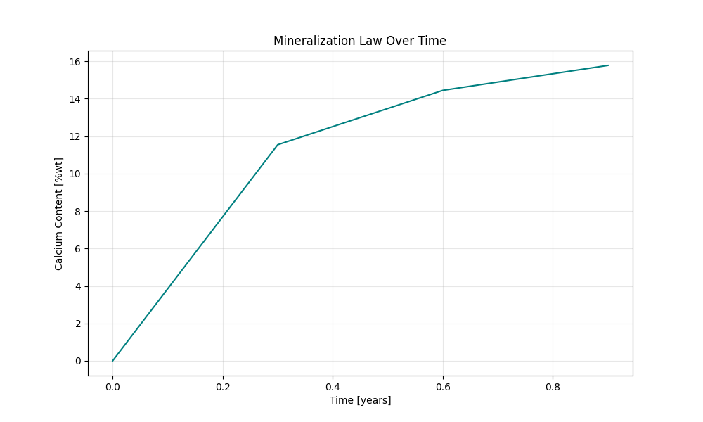

.. _bone_models.bone_mineralisation_models.examples:

Examples
========

This page demonstrates how to use different bone mineralisation models and visualize their results.
The requirement for running the models is the installation of the bone_models package via running the command
``pip install bone_models`` in the terminal.

Ruffoni Model Example
----------------------------------------------------

.. code-block:: python

        import matplotlib.pyplot as plt
        # import the Ruffoni model
        from bone_models.bone_mineralisation_models.models.ruffoni_model import Ruffoni_Model

        # Initialize the model with a BMDD starting condition
        # Simulate homeostatic conditions for 1 year with 500 calcium grid points
        model = Ruffoni_Model(simulation_time=1, number_of_grid_points=500, start='BMDD')
        # Solve the model, save results every 0.3 years
        BMDD_evolution, BV_evolution, time_points = model.solve_for_BMDD(save_interval=0.3)
        # Plot results
        model.plot_results(BMDD_evolution, BV_evolution, time_points)

This will generate a graph showing the BMDD evolution in homeostasis over time.
You can see minor changes due to numerical effects.

.. code-block:: python

        import matplotlib.pyplot as plt
        # import the Ruffoni model
        from bone_models.bone_mineralisation_models.models.ruffoni_model import Ruffoni_Model

        # Initialize the model with a mineralization law
        # Simulate homeostatic conditions for 1 year with 500 calcium grid points
        model = Ruffoni_Model(simulation_time=1, number_of_grid_points=500, start='mineralization law')
        # Solve the model
        BMDD_evolution, BV_evolution, time_points = model.solve_for_BMDD(save_interval=0.1)
        # Plot results
        model.plot_results(BMDD_evolution, BV_evolution, time_points)

This will generate a graph showing the BMDD evolution in homeostasis over time.
You can see minor changes due to numerical effects.

