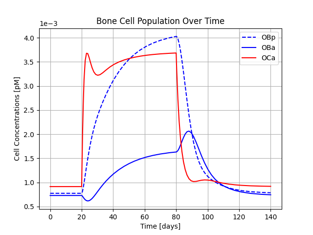

.. _bone_models.bone_mineralisation_models.examples:
Examples
========

This page demonstrates how to use different bone mineralisation models and visualize their results.
The requirement for running the models is the installation of the bone_models package via running the command
``pip install bone_models`` in the terminal.

Ruffoni Model Example
----------------------------------------------------

.. code-block:: python

        import matplotlib.pyplot as plt
        # import the Ruffoni model
        from bone_models.bone_mineralisation_models.models.ruffoni_model import Ruffoni_Model
        # import the load case - in this case Lemaire_Load_Case_5 that defines a PTH injection scenario
        from bone_models.bone_mineralisation_models.models.load_cases.ruffoni_load_cases import Ruffoni_Load_Case

This will generate a graph showing the BMDD evolution over time.

