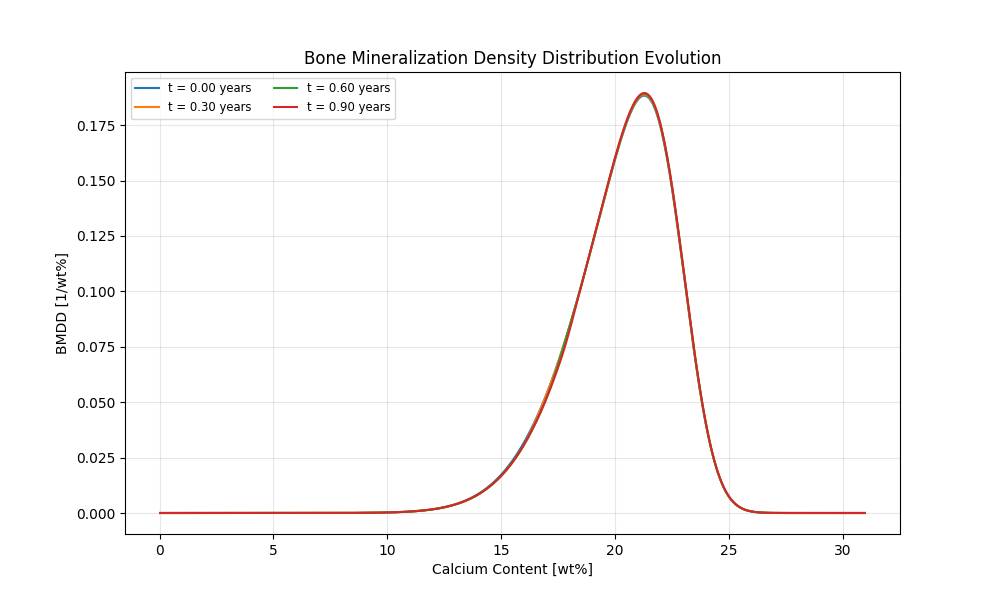
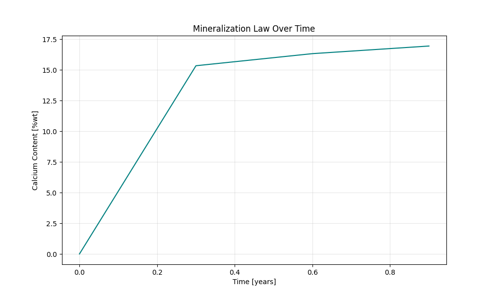
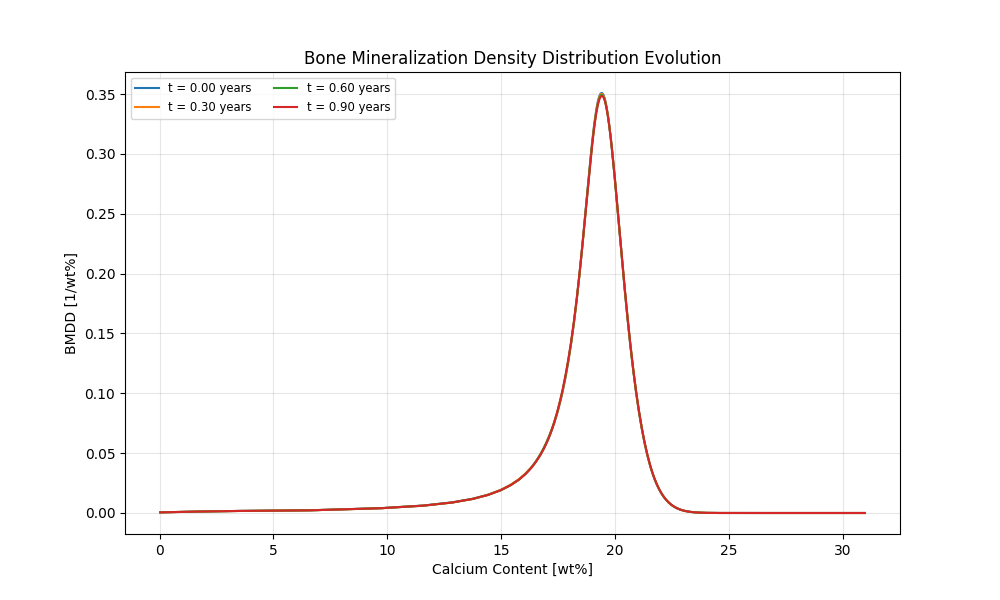
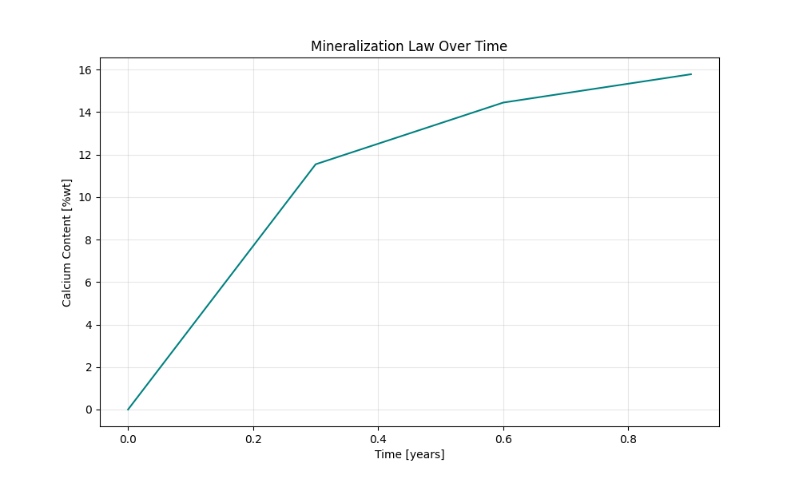
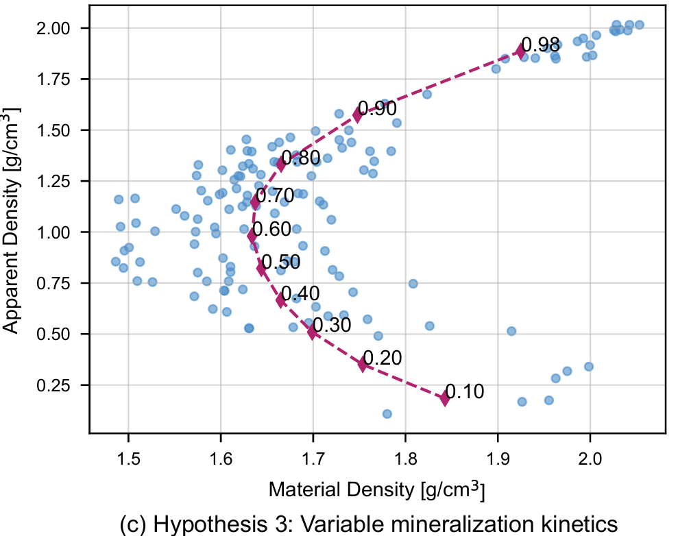
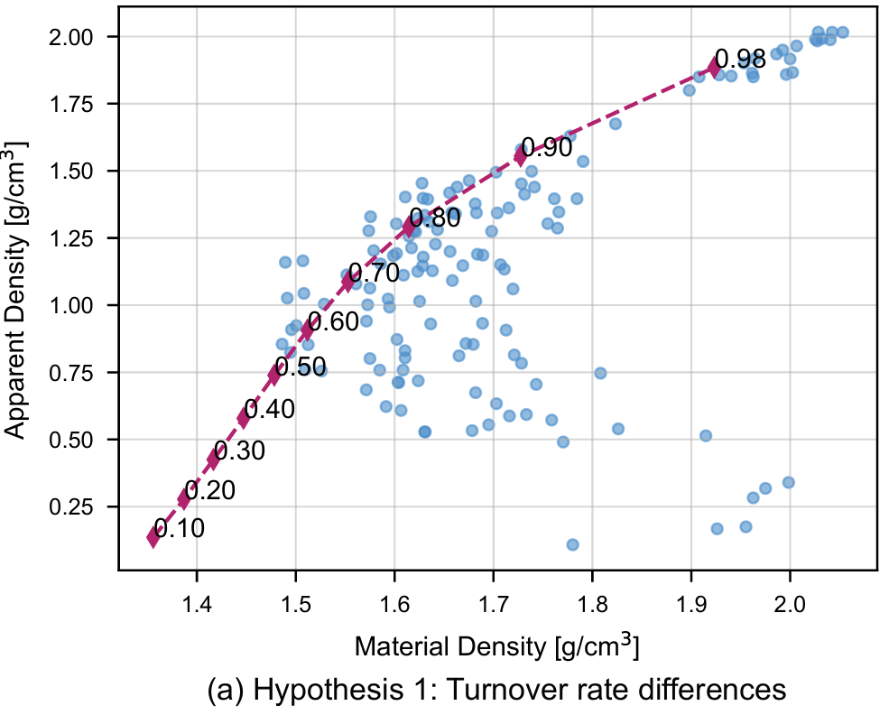

.. _bone_models.bone_mineralisation_models.examples:

Examples
========

This page demonstrates how to use different bone mineralisation models and visualize their results.
The requirement for running the models is the installation of the bone_models package via running the command
``pip install bone_models`` in the terminal.

Ruffoni Model Example
----------------------------------------------------

.. code-block:: python

        import matplotlib.pyplot as plt
        # import the Ruffoni model
        from bone_models.bone_mineralisation_models.models.ruffoni_model import Ruffoni_Model

        # Initialize the model with a BMDD starting condition
        # Simulate homeostatic conditions for 1 year with 500 calcium grid points
        model = Ruffoni_Model(simulation_time=1, number_of_grid_points=500, start='BMDD')
        # Solve the model, save results every 0.3 years
        BMDD_evolution, BV_evolution, time_points = model.solve_for_BMDD(save_interval=0.3)
        # Plot results
        model.plot_results(BMDD_evolution, BV_evolution, time_points)

This will generate a graph showing the BMDD evolution in homeostasis over time.
You can see minor changes due to numerical effects.

.. code-block:: python

        import matplotlib.pyplot as plt
        # import the Ruffoni model
        from bone_models.bone_mineralisation_models.models.ruffoni_model import Ruffoni_Model

        # Initialize the model with a mineralization law
        # Simulate homeostatic conditions for 1 year with 500 calcium grid points
        model = Ruffoni_Model(simulation_time=1, number_of_grid_points=500, start='mineralization law')
        # Solve the model
        BMDD_evolution, BV_evolution, time_points = model.solve_for_BMDD(save_interval=0.1)
        # Plot results
        model.plot_results(BMDD_evolution, BV_evolution, time_points)

This will generate a graph showing the BMDD evolution in homeostasis over time.
You can see minor changes due to numerical effects.

Modiz Model Example
----------------------------------------------------

.. code-block:: python

    from bone_mineralisation_models.models.modiz_model import Modiz_Model
    from bone_mineralisation_models.load_cases.modiz_load_cases import Modiz_Load_Case
    import matplotlib.pyplot as plt

    # Initialise model for several bone volume fractions and save results in lists
    load_case = Modiz_Load_Case()
    material_density_list, apparent_density_list = [], []
    bone_volume_fractions = [0.1, 0.2, 0.3, 0.4, 0.5, 0.6, 0.7, 0.8, 0.9, 0.98]

    for bone_volume_fraction in bone_volume_fractions:
        # Initialise model with load case ('neutral' - no disease state, only needed for implementation)
        # and bone volume fraction between 0 and 1
        # If called like this, hypothesis 3 (turnover and mineral apposition rate) is tested (default)
        model = Modiz_Model(load_case, bone_volume_fraction)
        if bone_volume_fraction >= 0.8:
            # extend queue for cortical bone
            model.parameters.mineralisation.length_of_queue = 45000
        material_density, apparent_density = model.calculate_mineral_densities(bone_volume_fraction)
        material_density_list.append(material_density)
        apparent_density_list.append(apparent_density)

    # Plot results vs. experimental data (published in PLOSOne Berli et al. 2017)
    plt.figure()
    plt.plot(material_density_list, apparent_density_list, marker='d', linestyle='--', label='Model Results')
    for i, bvf in enumerate(bone_volume_fractions):
        plt.annotate(f'{bvf:.2f}', (material_density_list[i], apparent_density_list[i]))
    plt.scatter(experimental_data.iloc[:, 2], experimental_data.iloc[:, 1], label='Experimental Data',)
    plt.xlabel(r'Material Density [g/cm$^3$]')
    plt.ylabel(r'Apparent Density [g/cm$^3$]')
    plt.legend()
    plt.show()

This will generate the following plot:

.. code-block:: python

    from bone_mineralisation_models.models.modiz_model import Modiz_Model
    from bone_mineralisation_models.load_cases.modiz_load_cases import Modiz_Load_Case
    import matplotlib.pyplot as plt

    # -------------- Plotting the hypothesis 1 --------------
    load_case = Modiz_Load_Case()
    material_density_list, apparent_density_list = [], []
    bone_volume_fractions = [0.1, 0.2, 0.3, 0.4, 0.5, 0.6, 0.7, 0.8, 0.9, 0.98]

    # Test hypothesis 1 (only turnover)
    for bone_volume_fraction in bone_volume_fractions:
        # Initialise model with load case ('neutral' - no disease state, only needed for implementation)
        # and bone volume fraction between 0 and 1
        # 'hypothesis' can be either 1, 2.1, 2.2 or 3 (defaults to 3) and determines which hypothesis from the paper is tested
        model = Modiz_Model(load_case, bone_volume_fraction, hypothesis=1)
        if bone_volume_fraction >= 0.8:
            # extend queue for cortical bone
            model.parameters.mineralisation.length_of_queue = 45000
        material_density, apparent_density = model.calculate_mineral_densities(bone_volume_fraction)
        material_density_list.append(material_density)
        apparent_density_list.append(apparent_density)

    # Plot material and apparent density for both hypotheses
    plt.figure()
    plt.plot(material_density_list, apparent_density_list, label='Hypothesis 1', marker='d', linestyle='--',)
    for i, bvf in enumerate(bone_volume_fractions):
        plt.annotate(f'{bvf:.2f}', (material_density_list, apparent_density_list))
    plt.scatter(experimental_data.iloc[:, 2], experimental_data.iloc[:, 1], label='Experimental Data',)
    plt.xlabel(r'Material Density [g/cm$^3$]')
    plt.ylabel(r'Apparent Density [g/cm$^3$]')
    plt.legend()
    plt.show()

This will generate the following plot:

