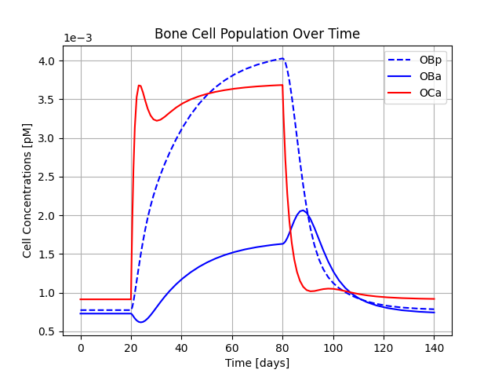

.. _bone_models.bone_spatial_models.examples:
Examples
============

This page demonstrates how to use different bone spatial models and visualize their results.
The requirement for running the models is the installation of the bone_models package via running the command
``pip install bone_models`` in the terminal.

Lerebours Model Example
----------------------------------------------------

.. code-block:: python

        import matplotlib.pyplot as plt
        from bone_models.bone_spatial_models.models.lerebours_model import Lerebours_Model
        from bone_models.bone_spatial_models.models.load_cases.lerebours_load_cases import Lerebours_Load_Case

This will generate a graph showing the evolution of BV/TV in a cross-section over time.

