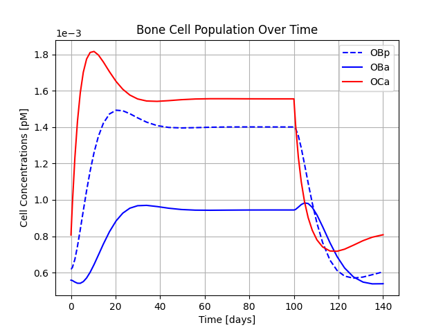
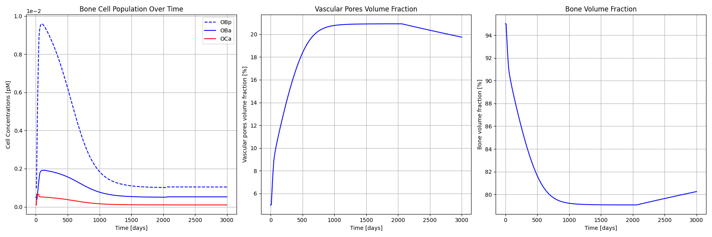
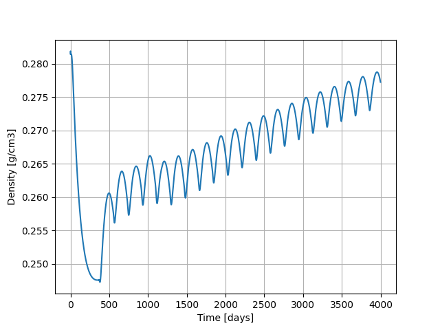
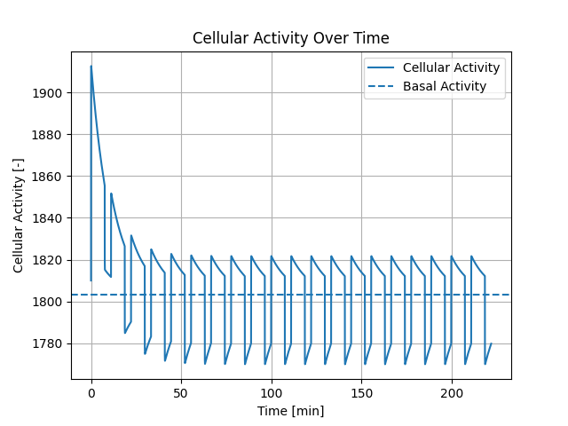
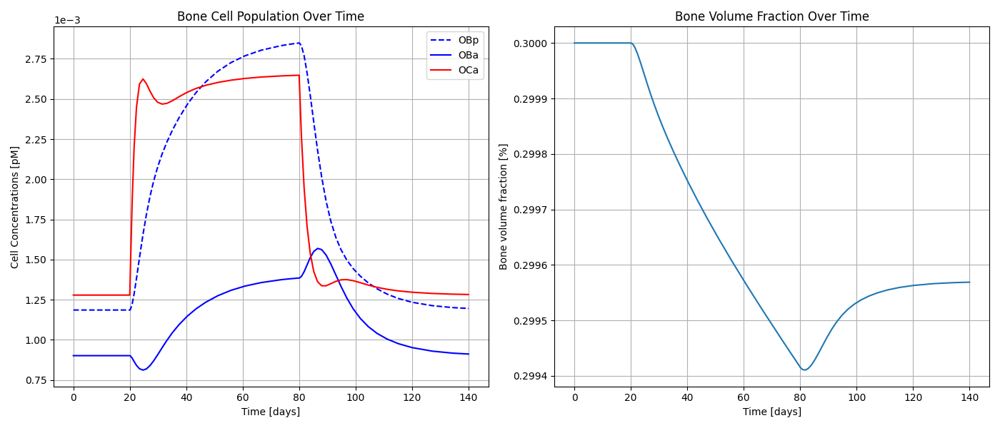

.. _bone_models.examples:
Examples
========

This page demonstrates how to use different bone remodeling models and visualize their results.
The requirement for running the models is the installation of the bone_models package via running the command
``pip install bone_models`` in the terminal.

Lemaire Model Example
----------------------------------------------------

.. code-block:: python

        import matplotlib.pyplot as plt
        # import the Lemaire model
        from bone_models.models import Lemaire_Model
        # import the load case - in this case Lemaire_Load_Case_5 that defines a PTH injection scenario
        from bone_models.load_cases.lemaire_load_cases import Lemaire_Load_Case_3

        # Define the time span for the simulation
        tspan = [0, 140]
        # Initialize the load case - in this case the load case determines a PTH injection according to
        # Lemaire et al. (2004)
        load_case = Lemaire_Load_Case_3()
        # Create a model instance with the load case
        model = Lemaire_Model(load_case)
        # Solve the model and get the solution
        # The solution contains time points and cell concentrations (OBp, OBa, OCa)
        solution = model.solve_bone_cell_population_model(tspan=tspan)

        # Plot the resulting bone cell concentrations
        plt.figure()
        plt.plot(solution.t, solution.y[0], label='OBp', color='blue', linestyle='--')
        plt.plot(solution.t, solution.y[1], label='OBa', color='blue')
        plt.plot(solution.t, solution.y[2], label='OCa', color='red')
        plt.ticklabel_format(axis='y', style='sci', scilimits=(0,0))
        plt.grid(True)
        plt.xlabel('Time [days]')
        plt.ylabel('Cell Concentrations [pM]')
        plt.title('Bone Cell Population Over Time')
        plt.legend()
        plt.show()

This will generate a graph showing the bone cell concentrations over time.

.. image:: _static/lemaire_model_results.png
   :alt: Example output of Lemaire Model
   :align: center
   :scale: 60%

Pivonka Model Example
----------------------------------------------------

.. code-block:: python

    import matplotlib.pyplot as plt
    # import the Pivonka model
    from bone_models.models import Pivonka_Model
    # import the load case - in this case Pivonka_Load_Case_1 that defines determines a PTH injection
    from bone_models.load_cases.pivonka_load_cases import Pivonka_Load_Case_1

    # Define the time span for the simulation
    tspan = [0, 1000]
    # Initialize the load case - in this case the load case determines a PTH injection according to Lemaire et al. (2004)
    load_case = Pivonka_Load_Case_1()
    # Create a model instance with the load case
    model = Pivonka_Model(load_case)
    # Solve the model and get the solution
    # The solution contains time points and cell concentrations (OBp, OBa, OCa)
    solution = model.solve_bone_cell_population_model(tspan=tspan)

    # Plot the resulting bone cell concentrations
    plt.figure()
    plt.plot(solution.t, solution.y[0], label='OBp', color='blue', linestyle='--')
    plt.plot(solution.t, solution.y[1], label='OBa', color='blue')
    plt.plot(solution.t, solution.y[2], label='OCa', color='red')
    plt.ticklabel_format(axis='y', style='sci', scilimits=(0,0))
    plt.grid(True)
    plt.xlabel('Time [days]')
    plt.ylabel('Cell Concentrations [pM]')
    plt.title('Bone Cell Population Over Time')
    plt.legend()
    plt.show()

This will generate a graph showing the bone cell concentrations over time.

Scheiner Model Example
----------------------------------------------------

.. code-block:: python

        from bone_models.models import Scheiner_Model
        from bone_models.load_cases.scheiner_load_cases import Scheiner_Load_Case
        import matplotlib.pyplot as plt

        # Define the time span for the simulation
        tspan = [0, 3000]
        # Initialize the load case - in this case the load case determines the disuse scenario according to
        # Scheiner et al. (2013)
        load_case = Scheiner_Load_Case()
        # Create a model instance with the load case
        model = Scheiner_Model(load_case)
        # Solve the model and get the solution
        # The solution contains time points, cell concentrations (OBp, OBa, OCa), vascular pores volume fraction,
        # bone volume fraction
        solution = model.solve_bone_cell_population_model(tspan=tspan)

        # Plot the resulting bone cell concentrations
        plt.figure()
        plt.plot(solution.t, solution.y[0], label='OBp', color='blue', linestyle='--')
        plt.plot(solution.t, solution.y[1], label='OBa', color='blue')
        plt.plot(solution.t, solution.y[2], label='OCa', color='red')
        plt.ticklabel_format(axis='y', style='sci', scilimits=(0,0))
        plt.grid(True)
        plt.xlabel('Time [days]')
        plt.ylabel('Cell Concentrations [pM]')
        plt.title('Bone Cell Population Over Time')
        plt.legend()
        # Plot the resulting vascular pores volume fraction
        plt.figure()
        plt.plot(solution.t, solution.y[3])
        plt.grid(True)
        plt.xlabel('Time [days]')
        plt.ylabel('Vascular pores volume fraction [%]')
        # Plot the resulting bone volume fraction
        plt.figure()
        plt.plot(solution.t, solution.y[4])
        plt.grid(True)
        plt.xlabel('Time [days]')
        plt.ylabel('Bone volume fraction [%]')
        plt.show()

This will generate graphs showing the bone cell concentrations, vascular pore volume fraction and bone volume fraction over time.

Martinez-Reina Model Example
----------------------------------------------------

.. code-block:: python

        from bone_models.models import Martinez_Reina_Model
        from bone_models.load_cases.martinez_reina_load_cases import Martinez_Reina_Load_Case
        import matplotlib.pyplot as plt

        # Define the time span for the simulation
        tspan = [0, 4000]
        # Initialize the load case - in this case the load case determines the PMO onset at the simulation start time
        # and denosumab injection every half year after 1 year of simulation according to
        # Martinez-Reina et al. (2019)
        load_case = Martinez_Reina_Load_Case()
        # Create a model instance with the load case
        model = Martinez_Reina_Model(load_case)
        # Solve the model and get the solution.
        # The solution contains time points, cell concentrations (OBp, OBa, OCa), vascular pores volume fraction,
        # bone volume fraction. Th solution is a list of arrays rather than the result of the solve_ivp function as the
        # model has to be solved in multiple steps.
        solution = model.solve_bone_cell_population_model(tspan=tspan)
        [time, OBp, OBa, OCa, vascular_pore_fraction, bone_volume_fraction] = solution

        # Plot the resulting apparent density, calculated each tim the ageing queue is updated
        plt.figure()
        plt.plot(np.arange(tspan[0], tspan[1], 1), model.bone_apparent_density)
        plt.grid(True)
        plt.xlabel('Time [days]')
        plt.ylabel('Density [g/cm3]')
        plt.show()

This will generate a graph showing the apparent density over time.

Martonova Model Example
----------------------------------------------------

.. code-block:: python

    import matplotlib.pyplot as plt
    # import the Martonova model
    from bone_models.models import Martonova_Model
    # import the load case - in this case Martonova_Hyperparathyroidism that defines a hyperparathyroidism scenario
    from bone_models.load_cases import Martonova_Hyperparathyroidism

    # Initialize the load case - in this case the load case determines hyperparathyroidism pulse characteristics according to
    # Martonova et al. (2023)
    load_case = Martonova_Hyperparathyroidism()
    # Create a model instance with the load case
    model = Martonova_Model(load_case)
    # Solve the model and get the solution
    cellular_activity, time, basal_activity, integrated_activity, cellular_responsiveness = model.solve_for_activity()

    plt.figure()
    plt.plot(time, cellular_activity, label='Cellular Activity')
    plt.axhline(y=basal_activity, color='r', linestyle='--', label='Basal Activity')
    plt.grid(True)
    plt.xlabel('Time [min]')
    plt.ylabel('Cellular Activity [-]')
    plt.title('Cellular Activity Over Time')
    plt.legend()
    plt.show()

This will generate graphs showing the cellular activity over time with the basal activity.

Modiz Model Example
----------------------------------------------------

.. code-block:: python

    import matplotlib.pyplot as plt
    # import the Pivonka model
    from bone_models.models import Modiz_Model
    # import the load case - in this case Modiz_Healthy_to_Hyperparathyroidism that defines a healthy to hyperparathyroidism scenario
    from bone_models.load_cases.modiz_load_cases import Modiz_Healthy_to_Hyperparathyroidism

    # Define the time span for the simulation
    tspan = [0, 140]
    # Initialize the load case - in this case the load case determines a healthy to hyperparathyroidism scenario according to Modiz et al. (2025)
    load_case = Modiz_Healthy_to_Hyperparathyroidism()
    # Create a model instance with the load case
    # The model type is 'cellular responsiveness' meaning the cellular responsiveness drives the activation by PTH
    # and the calibration type is 'all' meaning calibration includes all disease states
    model = Modiz_Model(load_case, model_type='cellular responsiveness', calibration_type='all')
    # Solve the model and get the solution
    # The solution contains time points and cell concentrations (OBp, OBa, OCa)
    solution = model.solve_bone_cell_population_model(tspan=tspan)
    # Calculate the bone volume fraction change over time depending on the previously calculated cell concentrations, steady state, and initial bone volume fraction
    bone_volume_fraction = model.calculate_bone_volume_fraction_change(solution.t, solution.y, [model.steady_state.OBp, model.steady_state.OBa, model.steady_state.OCa], 0.3)

    # Plot the resulting bone cell concentrations
    plt.figure()
    plt.plot(solution.t, solution.y[0], label='OBp', color='blue', linestyle='--')
    plt.plot(solution.t, solution.y[1], label='OBa', color='blue')
    plt.plot(solution.t, solution.y[2], label='OCa', color='red')
    plt.ticklabel_format(axis='y', style='sci', scilimits=(0,0))
    plt.grid(True)
    plt.xlabel('Time [days]')
    plt.ylabel('Cell Concentrations [pM]')
    plt.title('Bone Cell Population Over Time')
    plt.legend()
    # Plot the resulting bone volume fraction
    plt.figure()
    plt.plot(solution.t, bone_volume_fraction)
    plt.grid(True)
    plt.xlabel('Time [days]')
    plt.ylabel('Bone volume fraction [%]')
    plt.show()

This will generate graphs showing the bone cell dynamics and the bone volume fraction (with initial value 0.3) over time.

